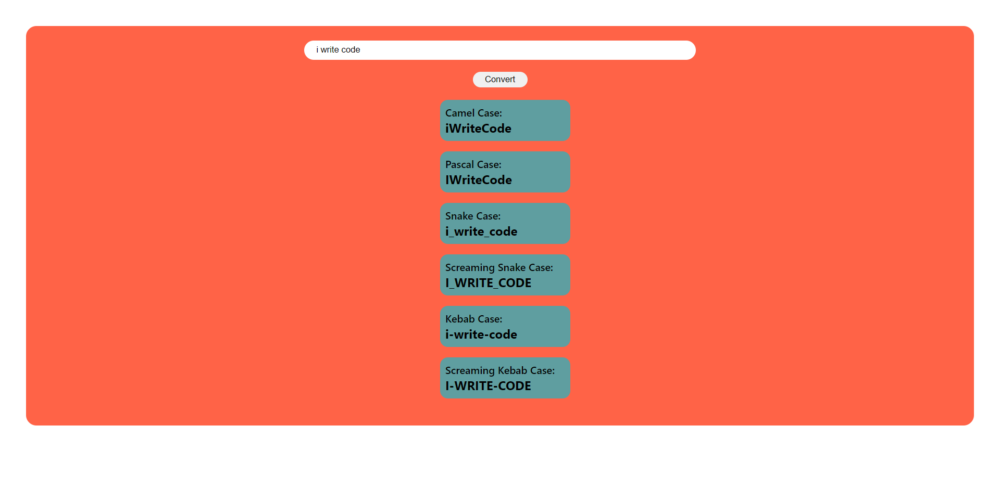

# Description
This is a simple project made to display the various ways programmers might write a certain given text. This includes the the naming conventions of camel case, pascal case, snake case, kebab case and screaming cases.

## Time Taken

1 hour and 30 mins approximately

[Live Demo](https://qrcodegen-akj.netlify.app/)

### SnapShot of the program

